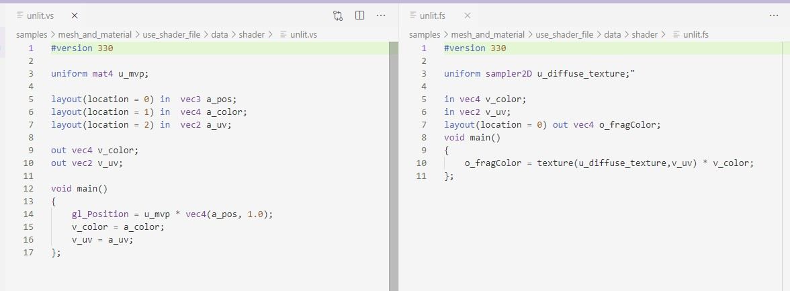

##7.3 Shader文件创建与使用

我们知道，Shader分为Vertex Shader(顶点Shader)和Fragment Shader(片段Shader)，之前项目的Shader代码是写死在`shader_source.h`，现在就将它们分别存放到`.vs`和`.fs`文件中。

###1. 创建Shader文件
创建`Unlit.vs` 和 `Unlit.fs`，将`shader_source.h`中的Shader代码放进去。

###2. 加载Shader文件
编写代码加载Shader文件，然后编译、创建Shader程序、Link。

